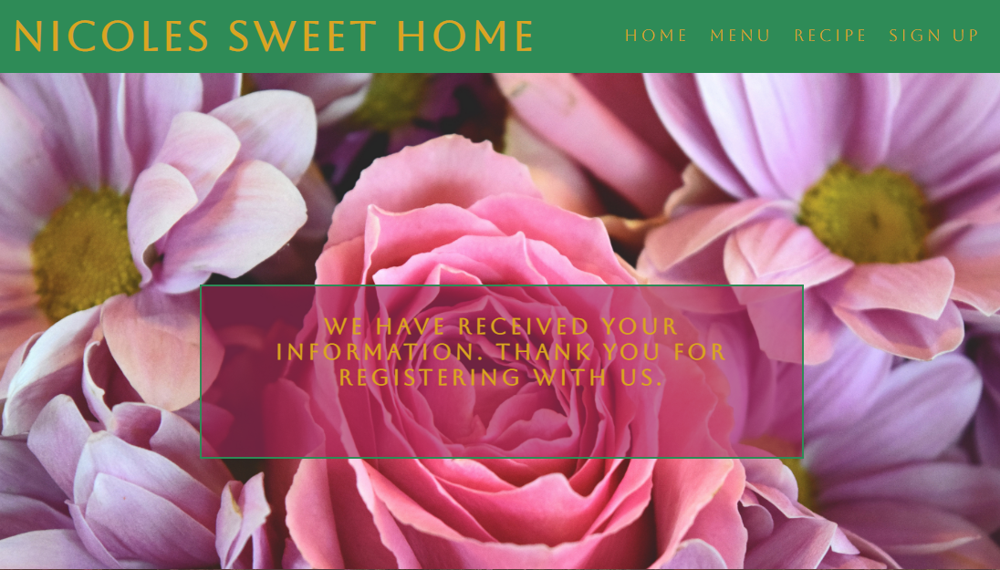

# Nicoles-Sweet-Home
## Description 
Nicoles Sweet Home is a website made to introduce people to a new home-made bakery, present its products and give them the possibility to register their interest. As for the bakery itself, it is designed to promote it, which will lead to an increase in the number of costumers and productibility. 
### User Stories
  * As a visiting user: I would like to see the menu list.
  * As a usual user: I would like to find the recipe of the week.
  * As a visiting user: I would like to sign up.
  * As a known costumer: I would like to find contact details as I already.

## Features
### Existing Features
  * Navigation Bar

The Navigation Bar includes links to the Logo, Home page, Menu, Recipe and Signup and it is identical and featured on all pages. 

This will allow the user to navigate easily between pages across more devices.

  * The landing page

The first area of the page is divided vertically into two parts: the left area includes an image with a welcome message for the user and the right area is a text destined to catch their interest.

  * Contact Section

This area of the page will give details for the user about opening times, contact details and address. Underneath the details, the user can find as well, map localisation that could be used to give exact directions.

  * Footer

The footer section is present on all pages and it includes links to all social media pages. It is useful for the user as it encourages them to keep connected through social media and it also helps the bakery, as it increases publicity. 

  * Menu Page

This page contains images and names of some of the cakes produced, which by their appetizing look, should encourage the user to want to try them. 

  * Recipe Page

It is an entertaining page, with a recipe that can be done and tried at home by the user. This page is planned to change recipe weekly which would maintain interest for the user.

  * The Sign-Up Page

This page will allow the user to get signed up for Nicoles Sweet Bakery. The user will be asked to submit their full name, and email address and create a password.

After submitting their details correctly, a user should be redirected to a page with a confirmation message, from where can easily return to any of the previous pages as it has the same navigation bar and footer.

### Features Left to Implement
The recipe page will be updated weekly with a new recipe that is designed to keep users' interest.

In time the site should allow the user to be able to make orders online and might increase the menu list.

## Typography and colour scheme
Colours have been specified in CSS by hexadecimal (or hex) values. The colours used are complementary colours.

The navigation bar and footer are cold green and the content is mostly pink, pink or red nuances. The text colour used is gold.

Green is meant to make the user think about fresh products and nature, then pink and gold to introduce him to the world of fairytales as if to say that despite being made with natural ingredients the products also look very good.

Font styles used are Aboreto, Abhaya Libre and Great Vibes. Most of the text is designed using Aboreto to keep the text classic. The area o the recipe - which allows inventiveness, is using Aboreto. Great Vibes is only used to replace the full logo "Nicoles Sweet Home" with the initials "NSH".
 
## Testing
From each page, you can navigate through the nav bar that includes: Home, Menu, Recipe and Sign Up, which when hovered over become underlined.

A similar aspect can be found on the footer on each page which could redirect you to Social Media Links, except for the fact that when hovered over they do not become underlined.

The landing page finds you with a welcome message and a text, then underneath it contact area, which when hovered over turns white and the map can be opened further and used for directions.
On the Menu page, you can view 6 types of cakes offered by the bakery with the title above them, when hovered over the title it changes colour.
The Sign-Up page comes with a signup form with 5 required inputs and one submit button which once submitted will take you to the confirmation page. also once hovered over the inputs they change colour from white to light pink.

Nicoles Sweet Home project looks and works on different browsers and screen sizes. Changes had to be made in regards to the alignment of content from horizontally aligned to vertically aligned, feature found on the first-page Contact area, Menu images and Recipe text and image.

* [Responsive:normalscreen](doc/screenshots/fullscreen.png)
* [Responsive:iPad](doc/screenshots/iPadMini.png)
* [Responsive:Iphone12Pro](doc/screenshots/iPhone12Pro.png)

### Validator Testing
#### HTML

No errors were returned when passing through the official W3C validator.

#### CSS

No errors were returned when passing through the official W3C CSS validator.

#### Lighthouse

Lighthouse testing scores:

## Deployment
The site was deployed to GitHub pages. The steps to deploy are as follows:
  * In the GitHub repository, navigate to the Settings tab
  * From the source section drop-down menu, select the Master Branch
  * Once the master branch has been selected, the page will be automatically refreshed with a detailed ribbon display to indicate the successful deployment.

## Credits
### Content
The text for the Home page was taken from [This Quotes Site](https://www.scarymommy.com/cake-quotes).

The Ingredients and Method from Recipe page was taken from [This Culinary Page](https://www.inspiredtaste.net/24593/essential-pancake-recipe/).
The icons in the footer were taken from [Font Awesome](https://fontawesome.com/).
### Media
The photos used were taken from [Pexels](https://www.pexels.com/ro-ro/), [Unsplash](https://unsplash.com/) and [StockVault](https://www.stockvault.net/).

